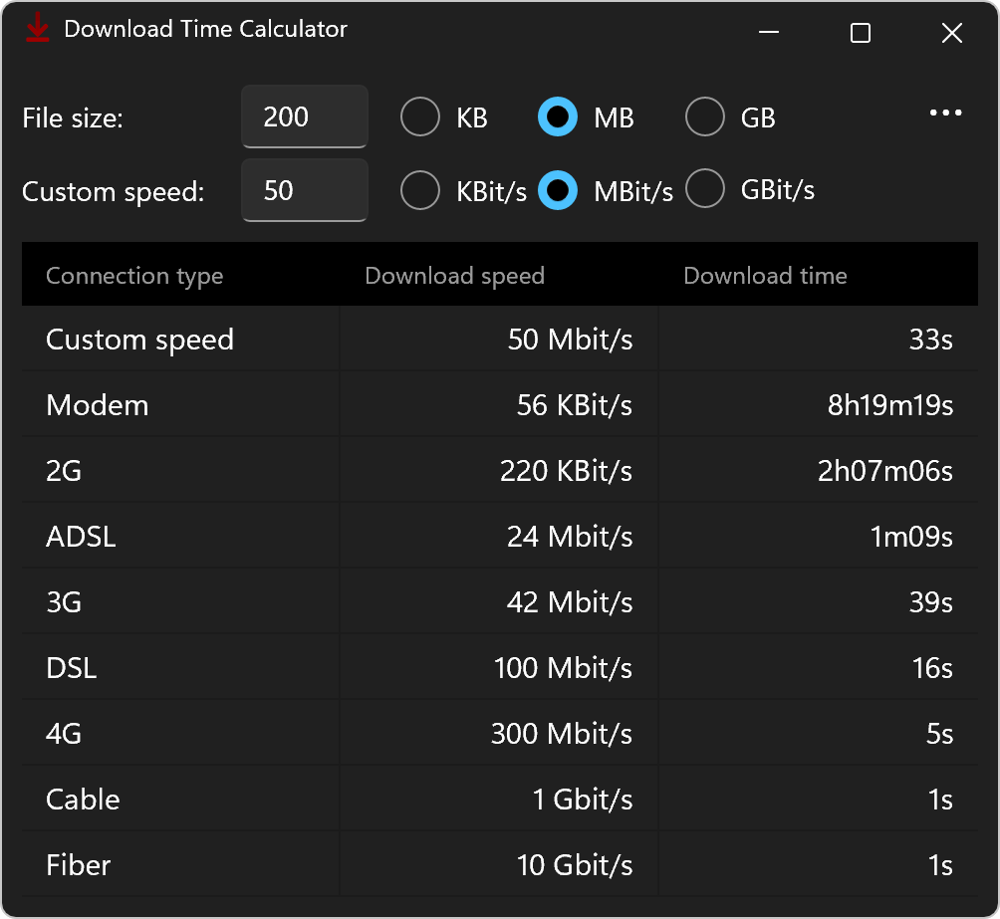

# Download Time Calculator Ultimate

This app allows you to calculate the download/upload time for files. The time it takes depends on the size of the file and your own download/upload speed. Of course, the speed of the server, e.g. a cloud storage provider, is also a factor: the calculation performed by the application assumes that the server has at least the same connection speed as yours.

## Screenshot

## Download

